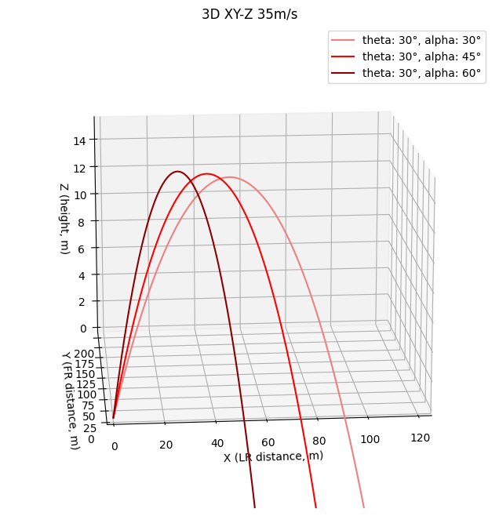
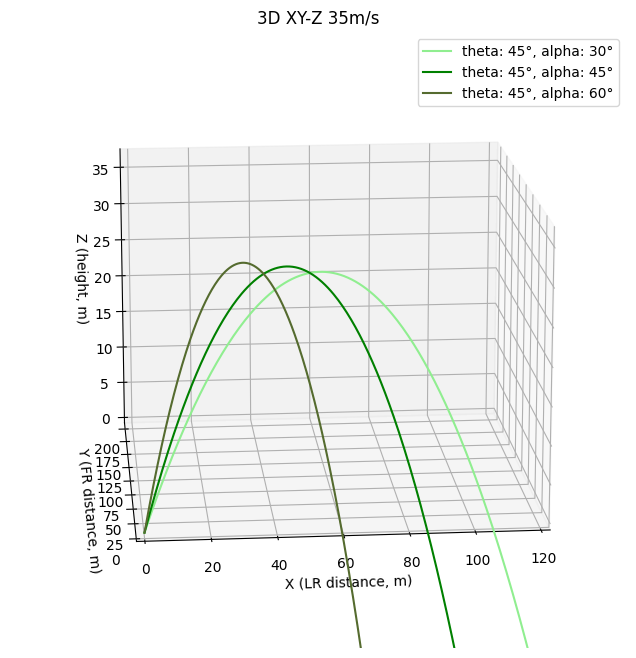
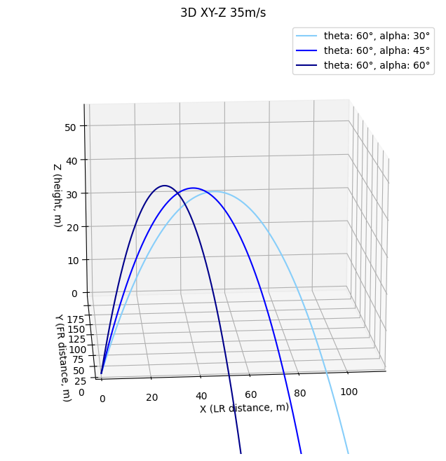

# 3D Parabola visualization

발사각도에 따른 물체의 포물선 궤적 변화의 시각화 -> 수직 - 수평 - 시간 | 수평 좌우 - 수평 앞뒤 - 수직 상하 그래프 표현

## 수직 - 수평 - 시간 그래프

|XT-Y 3D|
|:---:|
||

|XY|XT|YT|
|:---:|:---:|:---:|
||||

## 수평 좌우 - 수평 앞뒤 - 상하 그래프 (LR-FR-UD)

|발사각(theta)|PNG|GIF|
|:---:|:---:|:---:|
|30, 45, 60|||
|30|||
|45|||
|60|||
